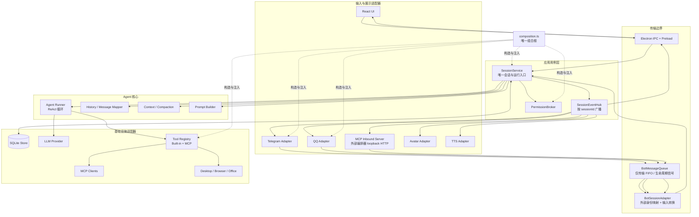
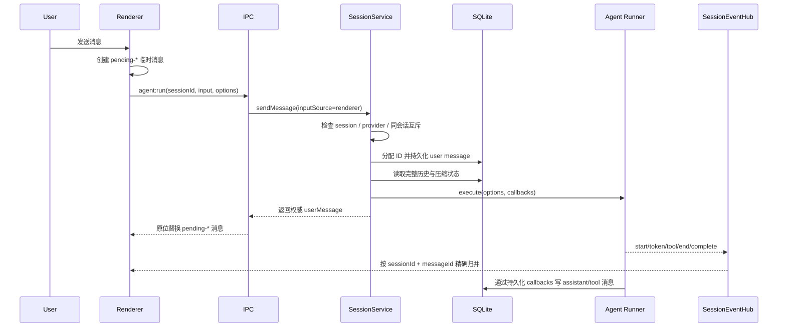
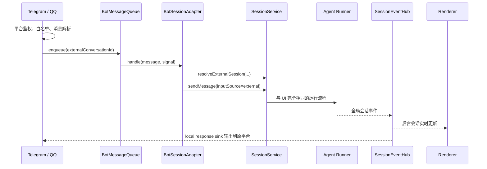
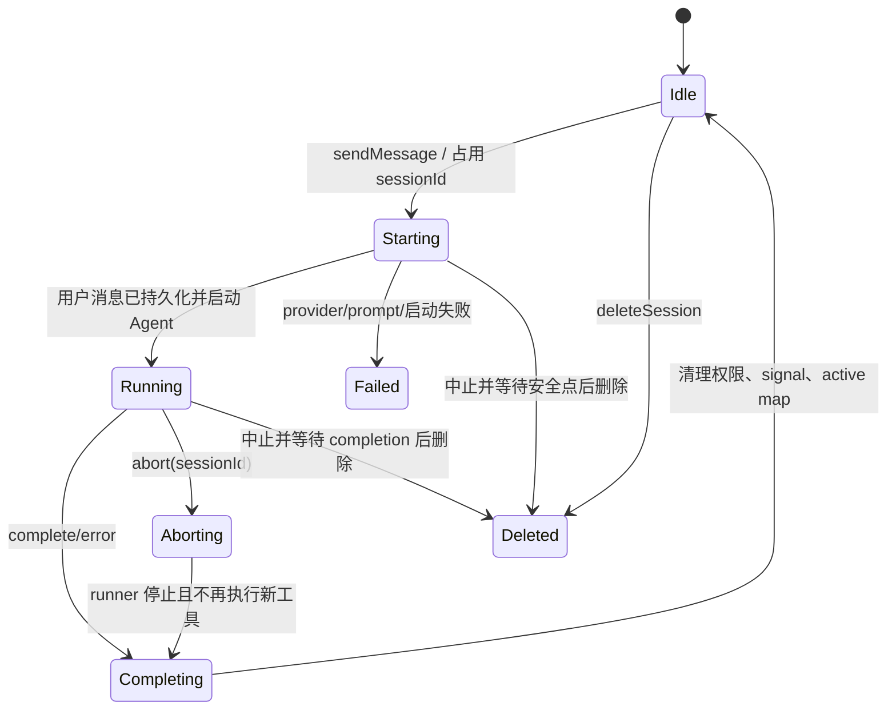

# Zhumora Architecture

本文档是 Zhumora 当前架构的权威说明，重点记录会话、消息、Agent、Bot、权限和事件之间的边界。

修改以下模块前必须先阅读本文档，并同时遵守 [`AGENTS.md`](./AGENTS.md)：

- `src/main/agent/`
- `src/main/ipc/`
- `src/main/bot/`、`src/main/telegram/`、`src/main/qq/`
- `src/main/store/`
- `src/preload/` 和 renderer 消息状态

如果实现与本文档不一致，不能悄悄引入第二套流程：应先确认正确方向，并在同一次变更中同步代码、本文档和测试。

## 1. 核心原则

Zhumora 只有一套会话消息与 Agent 运行用例：`SessionService`。它同时提供会话创建、查询、重命名、工作目录、删除和消息读取等核心会话 API；Avatar/TTS 等按会话保存的展示配置仍由各自适配器负责。

Electron UI、Telegram、QQ、对外 MCP 服务器（外部编排器）都只是输入/输出适配器。它们可以处理各自的连接、鉴权、消息格式和发送队列，但不得自行组装 Agent、维护会话运行状态、写入会话消息或实现权限策略。

必须始终成立：

1. 不同 `sessionId` 可以并行运行，互不影响。
2. 同一个 `sessionId` 同一时刻最多有一个 Agent run。
3. main/数据库是持久化消息 ID、历史、运行状态和权限结果的权威来源。
4. UI、Telegram、QQ 使用相同的历史构建、工具注册表、权限检查、压缩和中止语义。
5. 每个运行事件都带 `sessionId`；消息类事件还带 main 分配的权威 `messageId`。
6. 中止一个会话不会中止其他会话，并且中止后不能开始新的工具调用。
7. 压缩只改变发给 LLM 的 effective conversation，不删除或改写完整消息历史。

## 2. 总体架构图



依赖方向是“核心策略 → 应用编排 → 适配器 → 组合根负责装配”。图中的箭头表达运行时调用或事件流，不允许据此反向导入 UI、IPC 或具体数据库实现。

## 3. 所有权与职责

| 状态或行为 | 唯一 owner | 说明 |
|---|---|---|
| 活跃会话运行表 | `SessionService` | `Map<sessionId, run>`；实现同会话互斥和跨会话并行 |
| Agent 组装与启动 | `SessionService` | provider、历史、prompt、工具、权限、压缩回调均在此汇合 |
| ReAct 循环 | `runner.ts` | 只执行传入的单次运行，不读取 UI 或数据库 |
| 持久化历史与权威消息 ID | main + SQLite | renderer 只允许使用短生命周期的 `pending-*` 占位 |
| 全局会话事件 | `SessionEventHub` | renderer、Avatar、TTS 以及其他观察者统一订阅 |
| 工具权限请求生命周期 | `PermissionBroker` | UI/Bot presenter 仅负责展示和回传结果 |
| Bot 同一外部会话 FIFO | `BotMessageQueue` | 只保证传输顺序、传递 AbortSignal；不拥有 Agent 状态 |
| Bot 外部身份到 session 映射 | `SessionService` 存储边界 | Bot 适配器不得缓存第二份 session/run 映射 |
| 对外 MCP 服务器生命周期 | `McpServerManager` | 启动/停止/token/端口；不拥有会话与运行状态 |
| 外部编排器的任务状态 | `McpTaskSession`（taskProtocol 纯模块） | 等待/状态翻译；完成/权限/终态；子 agent 复用 |
| 外部编排器的权限裁决 | `PermissionBroker` + 模式门禁 | 仅 delegate+normal+非 alwaysConfirm 可外部批准；危险级恒归人 |
| renderer 消息缓存 | Zustand | 是数据库历史的投影，不是事实来源 |
| 进程服务构造和实现注入 | `composition.ts` | `runAgent`、provider、context、store、tools 在这里注入 |

`SessionService` 是唯一允许调用注入后的 Agent executor 的模块。`composition.ts` 可以导入 `runAgent` 以完成依赖装配，其他 IPC、Bot、工具和展示模块不得直接调用它。

## 4. UI 消息流程



关键约束：

- UI 输入的 user message 不再通过 `agent:user_message` 回推给同一个 renderer，否则会和 invoke 返回值产生双写。
- `SessionEventHub` 仍把该输入交给 Avatar/TTS 等观察者；IPC event sink 只将 `inputSource=external` 的用户消息作为外部新增消息推给 renderer。
- `agent:run` 只等待运行成功启动并返回权威 user message；Agent 在后台运行，后续结果走事件流。

## 5. Bot 消息流程



Bot 层只允许拥有：

- 平台连接和重连状态；
- 平台消息解析、白名单和附件下载；
- 同一外部会话的输入 FIFO；
- 平台专用 response stream 和 permission presenter。

Bot 层禁止拥有：

- `activeSessions`、Agent abort controller 或批准模式的第二份映射；
- 自己的 Agent callbacks 持久化路径；
- 自己的 provider/history/prompt/tool 组装；
- 通过全局 setter 把 Bot 状态接回 IPC runtime。

`/stop` 中止队列当前正在处理的输入，其 AbortSignal 会连接到 `SessionService` 对应 run。最终的会话中止、权限清理和全局事件由会话服务完成。

### MCP 入站：外部编排器与 Zhumora 对话

`McpServerManager`（组合根构造）让外部编排器（Claude Code、Codex 等）把 Zhumora 当一个"可对话的协作者"。它是第四个输入适配器，与 Bot 走完全相同的链路：`McpInboundService`（编排）→ `BotMessageQueue`（同会话 FIFO）→ `BotSessionAdapter` → `SessionService`。

约束：

- 传输是 loopback-only 的 MCP streamable-http 服务（`127.0.0.1` + Bearer token），由 `src/main/mcpServer/transport.ts` 拥有；`zhumora_chat` / `zhumora_respond` / `zhumora_status` 三个工具的 schema 与 JSON-RPC 路由也在该层。
- 外部 conversation（MCP 协议会话）到 Zhumora session 的映射走 `SessionService.resolveExternalSession('mcp', 'inbound', conversationKey, title)` 存储边界；同一编排器会话永远落到同一 Zhumora session（上下文可累积），不同编排器会话互相隔离。
- 任务状态由 `src/main/agent/taskProtocol.ts` 的 `McpTaskSession` 纯模块拥有：运行中 / 等待权限 / 完成 / 失败 / 中止。`zhumora_chat` 投递消息后至多等待 `wait_ms`，到期返回 `running` 转后台；任务终态保留在会话上，`zhumora_status` 轮询取回。内部子 agent 工具复用同一模块，不复制等待/状态逻辑。
- 权限呈现者恒注册（`DelegatePermissionPresenter`），两种模式下编排器都能看到 `awaiting_permission`。能否裁决由 `McpInboundService.respond` 的门禁控制：仅 `permissionMode='delegate'` 且工具为 `normal` 级且非 `alwaysConfirm` 时可被外部批准；`dangerous` 与能力边界变更永远留给 Zhumora 桌面 UI 的人类。裁决唯一入口是 `PermissionBroker.respond`，与 UI 呈现者共用 first-response-wins；外部无法裁决的请求保持挂起，不得被伪造为已拒绝。
- 外部会话使用 `inputSource='external'` 与固定的 `sourcePrompt`（声明对方是编排器而非人）；运行事件经全局 `SessionEventHub` 广播，侧边栏像 Bot 会话一样实时可见。
- 服务器生命周期（启动/停止/token）归 `McpServerManager`；设置经 `normalizeMcpServerSettings` 归一化，语义等价不重启，token 变化触发重启使旧 token 立即失效。token 留空时自动生成且不回写设置（只存在于运行中的传输层）。

## 6. 会话并发与生命周期



- `active` 的 key 只能是 `sessionId`，不能使用当前可见页面或平台 conversation ID。
- `active.has(sessionId)` 时，第二次 `sendMessage` 必须返回 busy；不能把两次运行混进同一历史。
- 不同 session 没有全局锁，可以同时请求不同 provider、执行不同工具。
- `abort(sessionId)` 只取消目标 run 和目标会话的权限请求。
- `deleteSession(sessionId)` 必须先中止并等待活动 run settle，再删除数据库记录，避免删除后 callback 继续写入。settle 等待是有界的：abort 后 runner 未能在 2s 内 settle（未响应信号的路径）时，`SessionService` 强制清理该 run 并记录错误，删除和 `stopAll()` 因此不会被卡死的 runner 永久挂起。
- `agent:run` 返回的 handle `completion` 与上述 settle 同有界性，并保留既有错误契约：中止时 reject `AgentAbortedError`、普通错误原样 reject、正常完成 resolve；卡死的 runner 在兜底触发时同样让出，等待者不会永久挂起。
- 应用退出时先停止 Bot 输入并调用 `SessionService.stopAll()`。

## 7. 事件与消息协议

所有 Agent 事件通过 `AgentEventSink` / `SessionEventHub` 传播。结构事件必须携带：

- `sessionId`：确定目标会话；
- `messageId`：确定 assistant/tool 消息；
- 明确的阶段或终止原因，不能依赖“当前消息”或数组末项猜测。

事件的主要消费者：

- IPC sink：映射到 preload/renderer 的强类型事件；
- Avatar sink：把运行状态投影为 idle/thinking/speaking；
- TTS sink：停止旧语音并消费最终 assistant 输出；
- Bot local sink：将当前 run 的输出发送到来源平台。

`SessionEventHub` 保存全局订阅者；每次运行通过 `forRun(localSink)` 把全局订阅者快照与来源平台的 local sink 合并。local sink 只活在本次运行中，不注册为新的进程级总线。

新增事件时必须同步检查 `main → preload → renderer`，并测试两个 session 事件交错时不会串线。

## 8. 权限流程

`PermissionBroker` 是唯一权限决策入口：

1. `SessionService` 根据 `sessionId`、当前 approve mode 和完整工具注册表创建 permission check。
2. Broker 向全局 UI presenter和本次运行的 Bot presenter 发出请求。
3. presenter 只能展示、校验响应者并调用 `respond`，不能自行执行工具。
4. 中止、删除、超时或运行结束必须清理该 session 的悬挂请求。
5. 工具在获得允许前不得执行；用户中止后即使迟到的允许结果也不能触发新工具。

## 9. 历史与压缩流程

- `messages` 表保存用户能看到的完整历史。
- `mapPersistedHistory` 同时生成 LLM messages 与平行 message IDs。
- `sanitizeHistoryWithIds` 必须同时增删消息和 ID，并删除悬空/非法 tool-call 组。
- compaction 只保存 `{upToMessageId, summary}`。
- 自动和手动压缩都必须复用相同的历史清洗和安全边界规则。
- assistant `tool_calls` 与全部对应 tool results 是不可拆分的原子组。

不要为 Bot、UI 或恢复逻辑各复制一份历史映射/压缩实现。

## 10. 依赖与文件边界

| 文件/目录 | 允许职责 |
|---|---|
| `src/main/agent/sessionService.ts` | 会话应用用例、运行所有权、依赖编排 |
| `src/main/agent/sessionEventHub.ts` | 进程内类型化事件广播 |
| `src/main/agent/runner.ts` | 单次 ReAct 状态机，不接触 DB/UI/Bot |
| `src/main/agent/persistedCallbacks.ts` | Agent callback 到持久化和领域事件的适配 |
| `src/main/bot/sessionAdapter.ts` | 外部消息转换后调用 Session API |
| `src/main/bot/messageQueue.ts` | 外部 conversation 的 FIFO 和 transport abort |
| `src/main/telegram/`、`src/main/qq/` | 平台协议适配，不实现会话规则 |
| `src/main/mcpServer/` | 对外 MCP 入站：loopback 传输、Bearer 鉴权、任务编排；不 import runner/store，不实现会话规则 |
| `src/main/agent/taskProtocol.ts` | 会话即服务的等待与状态翻译（纯模块，无 Electron/DB 依赖） |
| `src/main/ipc/` | 输入校验、调用 Session API、事件映射 |
| `src/main/store/` | SQLite repository 和迁移，不实现 Agent 决策 |
| `src/main/composition.ts` | 唯一组合根和具体实现注入 |
| `src/renderer/` | 会话投影、展示和交互，不成为持久化权威 |

### Renderer 聊天页更新边界

聊天页将高频输入和长历史渲染分成两个独立更新边界：

- `ChatComposer` 持有未发送文字、待发送附件和输入区菜单等短生命周期 UI 状态。键盘输入只允许重渲染 composer，不得把草稿状态提升到消息列表 owner，也不得写入 main/数据库。
- `MessageViewport` 按显式 `sessionId` 订阅该会话的消息、重试和压缩投影，负责消息列表派生数据与滚动。它不读取 composer 草稿，后台会话更新也不得触发当前 viewport。长历史由 Virtuoso 按动态高度虚拟化；row key 必须来自权威消息 ID 或显式派生事件 key，不能使用数组位置。
- `buildTimelineRows` 是消息 cache 到展示时间线的纯投影：只负责合并 tool 展示、插入压缩/重试行，不拥有或改写消息。虚拟列表只渲染投影结果；DB 和 renderer session cache 仍保存完整历史。
- 自动跟随输出只在用户已经位于底部时开启；用户上翻阅读后，新 token 不得强制抢回滚动位置。切换会话时按该会话的末尾初始化 viewport。
- `ChatView` 只组合 header、通知、viewport 和 composer；流式 token 内容变化不应导致整个聊天页外壳重渲染。

完整历史仍由数据库和 renderer session cache 保存。展示层的组件拆分、memo 和虚拟化只能减少渲染工作，不得改变消息 ID、持久化内容、压缩边界或 `SessionService` 所有权。

### Markdown 与图表渲染边界

- 消息的持久化真值始终是原始 Markdown 文本；图表 SVG 只是 renderer 的可丢弃投影，不写数据库、不进入 Agent 历史，也不新增 main/preload/IPC 协议。
- `MarkdownView` 通过 `extractFencedCodeBlocks` 按围栏闭合状态把消息切成"Markdown 片段 + mermaid 块"：已闭合的 `mermaid` fence 立即交给 `MermaidBlock` 渲染（流式输出中块一闭合就出图，不等整条消息完成）；未闭合的块连同其后内容暂按普通 Markdown（源码）展示，闭合后下一帧切出。reasoning 和压缩摘要不启用图表，保持源码展示，避免半截语法反复解析。
- 图表导出走 `settings:saveDiagram` IPC：renderer 传入已 sanitize 并规范化（`formatStandaloneSvg` 补全 xmlns/宽高）的 SVG 与原始源码，main 经 `showSaveDialog` 落盘 `.svg`（源码写入文件头注释）。它只是 renderer 投影到用户文件系统的单向动作，不新增持久化状态、不进数据库、不改变消息内容。
- `promptBuilder` 只声明这项 renderer 展示能力和安全输出规范，不把 Mermaid 注册为工具。来源适配器要求纯文本时，其 source prompt 优先，模型不得输出 Mermaid block。
- `MermaidRenderer` 是 renderer 组合根创建的进程级 owner。由于 Mermaid 配置是库级可变状态，初始化和渲染必须串行；缓存以 `theme + 完整 source` 为 key，容量有界，主题或源码变化自然失效。
- 图表使用 `securityLevel: strict`、关闭 HTML labels、限制源码长度和边数量，并对生成 SVG 再执行 DOMPurify SVG allowlist 清洗；URI 属性和非本地 CSS `url(...)` 资源也必须移除。禁止启用点击回调、任意 HTML、脚本、`foreignObject`、外链对象或其他交互绑定。
- 渲染失败、输入为空或超过限制时必须显示可复制源码；图表只是渐进增强，不能令整条消息不可读。

## 11. 禁止回归的旧设计

以下旧组件已经删除，不得以新名字恢复同类职责：

- `BotAgentBridge`：Bot 不再直接组装或运行 Agent；
- `BotRunCoordinator`：Bot 不再拥有 session run/activity/permission 状态；
- `AgentIpcRuntime`：IPC 不再拥有 active runs、abort controllers 或 approve modes。

同时禁止：

- 从 IPC、Telegram、QQ 或工具模块直接调用 `runAgent`；
- 在适配器中直接写 user/assistant/tool 会话消息；
- 通过模块级可变 Map、setter 或动态 `require` 拼接运行状态；
- 用“最后一条消息”“当前会话”推断事件目标；
- 为新平台复制一整套 Agent 执行链。

## 12. 扩展方式

### 新增聊天平台

1. 在平台模块实现连接、身份验证、输入解析、输出和权限 presenter。
2. 使用 `BotMessageQueue` 保证每个外部 conversation 的输入顺序。
3. 将标准化消息交给 `BotSessionAdapter`。
4. 不修改 runner，不创建新的 active session map，不直接访问消息 repository。
5. 增加平台适配测试和“同 conversation 串行、不同 conversation 并行、中止隔离”测试。

对外 MCP 服务器（§5 的 MCP 入站）属于同一类适配器：`McpInboundService` 只编排“conversation → 任务状态”，会话与运行规则仍全部落在 `SessionService` 与 `PermissionBroker`，不得为外部编排器复制第二套 Agent 执行链。

### 新增会话入口

任何新的 CLI、HTTP、语音或自动化入口都必须调用 `SessionService`，并明确：

- 外部身份如何稳定映射为 `sessionId`；
- 输入来源是 `renderer` 还是 `external`；
- 输出通过全局事件订阅还是本次运行的 local sink 消费；
- 中止信号如何连接到目标 session。

### 自动化或定时任务

当前仓库没有定时任务模块、scheduler runtime 或 scheduled-job 数据表。不得因为其他功能需要延迟执行，就顺手恢复已经删除的旧调度链路。

未来如果产品重新引入自动化，它必须满足：

1. scheduler 只负责触发时间、启停和投递，是 `SessionService` 的输入适配器；
2. 使用稳定身份映射到 session，并遵守同 session 互斥、跨 session 并行；
3. 输出走 `SessionEventHub`，权限走 `PermissionBroker`，不复制 Agent callbacks；
4. 不把整段任务实现代码塞进工具参数或消息 JSON；复杂任务保存结构化引用，由执行时读取；
5. schema 只能通过单调 migration 引入，并覆盖 fresh/legacy upgrade 测试；
6. 产品行为、失败通知、重试和取消语义必须先写入本文档，再实现代码。

### 修改会话运行

涉及 provider、历史、prompt、权限、工具或压缩时，先判断逻辑属于：

- `SessionService` 的应用编排；
- runner 的单次运行状态机；
- 纯策略模块；
- 基础设施适配器。

不能为了少改文件而把规则重新堆回 IPC 或 Bot service。

## 13. 必须执行的验证

所有会话架构改动至少运行：

```powershell
npm test
npm run build
```

并按改动覆盖：

- 不同 session 并行；
- 同 session 防重入；
- 中止/权限拒绝后不执行新工具；
- 删除活动 session 不产生删除后的 DB 写入；
- UI pending message 只被权威 ID 原位替换一次；
- external user message 能更新已加载的 renderer 会话；
- Bot 同 conversation FIFO、跨 conversation 并行；
- tool-call 序列和 message IDs 在清洗/压缩后保持合法且平行对齐。
