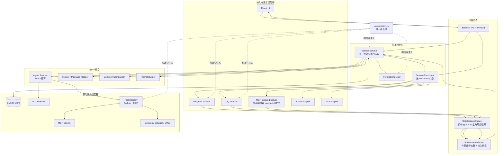
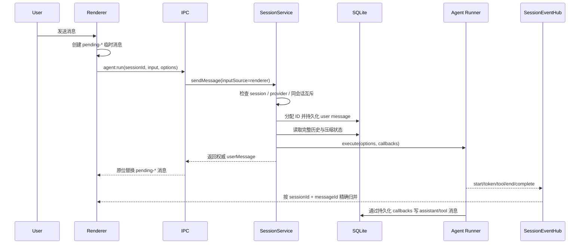
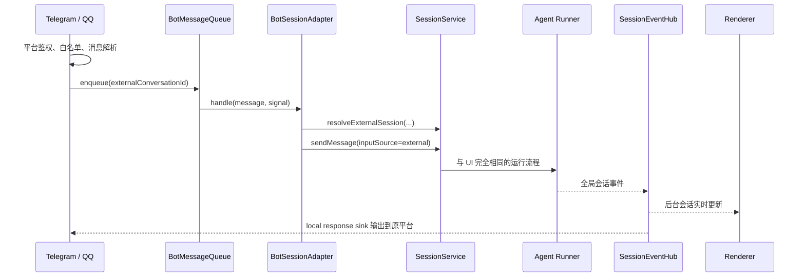
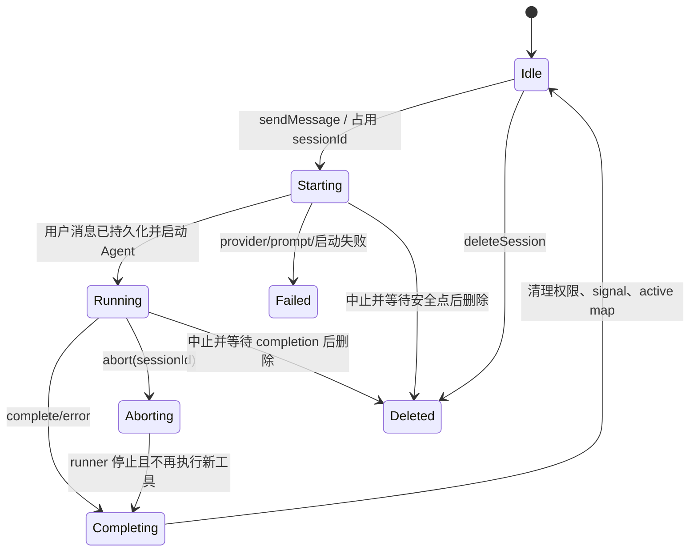

# Zhumora Architecture

本文档是 Zhumora 当前架构的权威说明，重点记录会话、消息、Agent、Bot、权限和事件之间的边界。

修改以下模块前必须先阅读本文档，并同时遵守 [`AGENTS.md`](./AGENTS.md)：

- `src/main/agent/`
- `src/main/ipc/`
- `src/main/bot/`、`src/main/telegram/`、`src/main/qq/`
- `src/main/store/`
- `src/preload/` 和 renderer 消息状态

如果实现与本文档不一致，不能悄悄引入第二套流程：应先确认正确方向，并在同一次变更中同步代码、本文档和测试。

## 1. 核心原则

Zhumora 只有一套会话消息与 Agent 运行用例：`SessionService`。它同时提供会话创建、查询、重命名、工作目录、删除和消息读取等核心会话 API；Avatar/TTS 等按会话保存的展示配置仍由各自适配器负责。

Electron UI、Telegram、QQ、对外 MCP 服务器（外部编排器）都只是输入/输出适配器。它们可以处理各自的连接、鉴权、消息格式和发送队列，但不得自行组装 Agent、维护会话运行状态、写入会话消息或实现权限策略。

必须始终成立：

1. 不同 `sessionId` 可以并行运行，互不影响。
2. 同一个 `sessionId` 同一时刻最多有一个 Agent run。
3. main/数据库是持久化消息 ID、历史、运行状态和权限结果的权威来源。
4. UI、Telegram、QQ 使用相同的历史构建、工具注册表、权限检查、压缩和中止语义。
5. 每个运行事件都带 `sessionId`；消息类事件还带 main 分配的权威 `messageId`。
6. 中止一个会话不会中止其他会话，并且中止后不能开始新的工具调用。
7. 压缩只改变发给 LLM 的 effective conversation，不删除或改写完整消息历史。

## 2. 总体架构图


```mermaid
flowchart TB
  subgraph Inputs[输入与展示适配器]
    UI[React UI]
    TG[Telegram Adapter]
    QQ[QQ Adapter]
    MCPIN[MCP Inbound Server<br/>外部编排器 loopback HTTP]
    AV[Avatar Adapter]
    TTS[TTS Adapter]
  end

  subgraph Transport[传输边界]
    IPC[Electron IPC + Preload]
    BQ[BotMessageQueue<br/>仅传输 FIFO / 生命周期信号]
    BA[BotSessionAdapter<br/>外部身份映射 + 输入转换]
  end

  subgraph Application[应用用例层]
    SS[SessionService<br/>唯一会话与运行入口]
    EH[SessionEventHub<br/>按 sessionId 广播]
    PB[PermissionBroker]
  end

  subgraph AgentCore[Agent 核心]
    RUN[Agent Runner<br/>ReAct 循环]
    HIST[History / Message Mapper]
    CTX[Context / Compaction]
    PROMPT[Prompt Builder]
  end

  subgraph Adapters[基础设施适配器]
    DB[(SQLite Store)]
    LLM[LLM Provider]
    TOOLS[Tool Registry<br/>Built-in + MCP]
    MCP[MCP Clients]
    DESK[Desktop / Browser / Office]
  end

  ROOT[composition.ts<br/>唯一组合根]

  UI --> IPC --> SS
  TG --> BQ --> BA --> SS
  QQ --> BQ --> BA
  MCPIN --> BQ --> BA

  SS --> HIST
  SS --> CTX
  SS --> PROMPT
  SS --> PB
  SS --> RUN
  SS <--> DB
  RUN --> LLM
  RUN --> TOOLS
  TOOLS --> MCP
  TOOLS --> DESK

  SS --> EH
  EH --> IPC --> UI
  EH --> TG
  EH --> QQ
  EH --> MCPIN
  EH --> AV
  EH --> TTS

  ROOT -.构造与注入.-> SS
  ROOT -.构造与注入.-> PB
  ROOT -.构造与注入.-> TOOLS
  ROOT -.构造与注入.-> TG
  ROOT -.构造与注入.-> QQ
```

依赖方向是“核心策略 → 应用编排 → 适配器 → 组合根负责装配”。图中的箭头表达运行时调用或事件流，不允许据此反向导入 UI、IPC 或具体数据库实现。

## 3. 所有权与职责

| 状态或行为 | 唯一 owner | 说明 |
|---|---|---|
| 活跃会话运行表 | `SessionService` | `Map<sessionId, run>`；实现同会话互斥和跨会话并行 |
| Agent 组装与启动 | `SessionService` | provider、历史、prompt、工具、权限、压缩回调均在此汇合 |
| ReAct 循环 | `runner.ts` | 只执行传入的单次运行，不读取 UI 或数据库 |
| 持久化历史与权威消息 ID | main + SQLite | renderer 只允许使用短生命周期的 `pending-*` 占位 |
| 全局会话事件 | `SessionEventHub` | renderer、Avatar、TTS 以及其他观察者统一订阅 |
| 工具权限请求生命周期 | `PermissionBroker` | UI/Bot presenter 仅负责展示和回传结果 |
| Bot 同一外部会话 FIFO | `BotMessageQueue` | 只保证传输顺序、传递 AbortSignal；不拥有 Agent 状态 |
| Bot 外部身份到 session 映射 | `SessionService` 存储边界 | Bot 适配器不得缓存第二份 session/run 映射 |
| 对外 MCP 服务器生命周期 | `McpServerManager` | 启动/停止/token/端口；不拥有会话与运行状态 |
| 外部编排器的任务状态 | `McpTaskSession`（taskProtocol 纯模块） | 等待/状态翻译；有界活动游标；完成/权限/终态；子 agent 复用 |
| 外部编排器的权限裁决 | `PermissionBroker` + 模式门禁 | 仅 delegate+normal+非 alwaysConfirm 可外部批准；危险级恒归人 |
| renderer 消息缓存 | Zustand | 是数据库历史的投影，不是事实来源 |
| 主窗口关闭→后台 / 真退出判定点 | `main/index.ts` 的 `quitting` 标志 + `backgroundPolicy.shouldCloseInsteadOfHide` | 关窗 hide；退出只走托盘/系统关机→`app.quit()`→`before-quit` |
| 主窗口外部导航判定 | `navigationPolicy.decideNavigation`（`will-navigate` + `setWindowOpenHandler` 唯一判定点） | 同源放行；http(s) 转系统浏览器；file:/javascript:/自定义协议一律拒绝 |
| 后台可见性（托盘菜单 + 系统通知） | `BackgroundManager`（`src/main/background.ts`） | 只读投影，订阅 SessionEventHub/PermissionBroker，不拥有会话与运行状态 |
| 进程服务构造和实现注入 | `composition.ts` | `runAgent`、provider、context、store、tools 在这里注入 |

`SessionService` 是唯一允许调用注入后的 Agent executor 的模块。`composition.ts` 可以导入 `runAgent` 以完成依赖装配，其他 IPC、Bot、工具和展示模块不得直接调用它。

## 4. UI 消息流程


```mermaid
sequenceDiagram
  participant User
  participant UI as Renderer
  participant IPC
  participant Session as SessionService
  participant DB as SQLite
  participant Agent as Agent Runner
  participant Events as SessionEventHub

  User->>UI: 发送消息
  UI->>UI: 创建 pending-* 临时消息
  UI->>IPC: agent:run(sessionId, input, options)
  IPC->>Session: sendMessage(inputSource=renderer)
  Session->>Session: 检查 session / provider / 同会话互斥
  Session->>DB: 分配 ID 并持久化 user message
  Session->>DB: 读取完整历史与压缩状态
  Session->>Agent: execute(options, callbacks)
  Session-->>IPC: 返回权威 userMessage
  IPC-->>UI: 原位替换 pending-* 消息
  Agent-->>Events: start/token/tool/end/complete
  Events-->>UI: 按 sessionId + messageId 精确归并
  Agent->>DB: 通过持久化 callbacks 写 assistant/tool 消息
```

关键约束：

- UI 输入的 user message 不再通过 `agent:user_message` 回推给同一个 renderer，否则会和 invoke 返回值产生双写。
- `SessionEventHub` 仍把该输入交给 Avatar/TTS 等观察者；IPC event sink 只将 `inputSource=external` 的用户消息作为外部新增消息推给 renderer。
- `agent:run` 只等待运行成功启动并返回权威 user message；Agent 在后台运行，后续结果走事件流。

## 5. Bot 消息流程


```mermaid
sequenceDiagram
  participant Platform as Telegram / QQ
  participant Queue as BotMessageQueue
  participant Adapter as BotSessionAdapter
  participant Session as SessionService
  participant Agent as Agent Runner
  participant Hub as SessionEventHub
  participant UI as Renderer

  Platform->>Platform: 平台鉴权、白名单、消息解析
  Platform->>Queue: enqueue(externalConversationId)
  Queue->>Adapter: handle(message, signal)
  Adapter->>Session: resolveExternalSession(...)
  Adapter->>Session: sendMessage(inputSource=external)
  Session->>Agent: 与 UI 完全相同的运行流程
  Agent-->>Hub: 全局会话事件
  Hub-->>UI: 后台会话实时更新
  Hub-->>Platform: local response sink 输出到原平台
```

Bot 层只允许拥有：

- 平台连接和重连状态；
- 平台消息解析、白名单和附件下载；
- 同一外部会话的输入 FIFO；
- 平台专用 response stream 和 permission presenter。

Bot 层禁止拥有：

- `activeSessions`、Agent abort controller 或批准模式的第二份映射；
- 自己的 Agent callbacks 持久化路径；
- 自己的 provider/history/prompt/tool 组装；
- 通过全局 setter 把 Bot 状态接回 IPC runtime。

`/stop` 中止队列当前正在处理的输入，其 AbortSignal 会连接到 `SessionService` 对应 run。最终的会话中止、权限清理和全局事件由会话服务完成。

### MCP 入站：外部编排器与 Zhumora 对话

`McpServerManager`（组合根构造）让外部编排器（Claude Code、Codex 等）把 Zhumora 当一个"可对话的协作者"。它是第四个输入适配器，与 Bot 走完全相同的链路：`McpInboundService`（编排）→ `BotMessageQueue`（同会话 FIFO）→ `BotSessionAdapter` → `SessionService`。

约束：

- 传输是 loopback-only 的 MCP streamable-http 服务（`127.0.0.1` + Bearer token），由 `src/main/mcpServer/transport.ts` 拥有；Streamable HTTP、JSON-RPC、协议版本协商和 `Mcp-Session-Id` 生命周期使用官方 `@modelcontextprotocol/sdk`，本地代码只负责鉴权、session 路由和 `zhumora_chat` / `zhumora_wait` / `zhumora_respond` / `zhumora_status` 工具适配。禁止重新手写一套 MCP 协议状态机。
- MCP 协议的 `Mcp-Session-Id` 是外部 conversation 的唯一键；不得使用 `clientInfo.name`、客户端名称或缺失 session 时的全局 `default` 代替。未知/过期 session 必须拒绝，DELETE 关闭时清理映射。该 conversation 到 Zhumora session 的映射走 `SessionService.resolveExternalSession('mcp', 'inbound', conversationKey, title)` 存储边界；同一 MCP session 永远落到同一 Zhumora session（上下文可累积），不同 MCP session 互相隔离。
- 对外可发现性同时放在三层：initialize `instructions`（声明 Zhumora 是可主动委托的 subagent）、`delegate-to-zhumora` MCP prompt（支持 prompts 的 host 可显式取用）、每个 tool 的强工作流描述（描述以“什么时候该委托”开头，并内联典型任务示例与负范围声明）。注意多数 host 不会把 initialize instructions 可靠注入模型上下文（opencode 无此通道，Codex 仅新版支持且从不消费 prompts），因此“委托意愿”文案必须写进 `zhumora_chat` 的工具描述——那是 Codex / opencode 模型唯一能看见的文字。措辞：`shared/mcpServer.ts` 的 `DELEGATION_IDENTITY` / `DELEGATION_PROTOCOL` 拼出 `SERVER_INSTRUCTIONS`（initialize），工具描述在 `protocol.ts` 内维护，两者由单测分别锁住同一组要素，不许各说各话。委托意愿措辞的三根支柱由单测锁死：同机能力声明（Zhumora 与编排器操作同一台机器的文件/应用/GUI/浏览器）、典型任务示例（给模型归类锚点）、负范围声明（沙箱内任务编排器自己做，消除边界不确定导致的默认保守）。三层都要求“一次投递、跟进至终态、不得把 running 当完成”。
- 任务状态由 `src/main/agent/taskProtocol.ts` 的 `McpTaskSession` 纯模块拥有：运行中 / 等待权限 / 完成 / 失败 / 中止。`zhumora_chat` 投递消息后至多等待 `wait_ms`，到期返回 `running` 转后台；调用方随后用返回的 `task_id + cursor` 调用 `zhumora_wait`。`zhumora_wait` 默认保持一个有界请求直到终态、权限请求或超时，它是兼容稳定 MCP 客户端的完成回调路径；`zhumora_status` 只保留作瞬时诊断/兼容查询，提示词禁止定时轮询。任务终态和有界活动环保留在会话上，断线重连后仍可取回。内部子 agent 工具复用同一模块，不复制等待/状态逻辑。
- 活跃的 `zhumora_chat` / `zhumora_wait` 请求通过官方 `notifications/progress` 发送 request-scoped SSE 进度；最终工具结果仍是同一 JSON-RPC 请求的权威完成响应。当前稳定协议没有可移植的“工具返回后再异步回调模型”语义，实验性 MCP Tasks 也不是所有客户端都协商，因此不得只依赖 Tasks 或私有通知。后台任务用 `zhumora_wait` 的长等待恢复同一语义。
- 外部活动流是 `SessionService` 本次运行 local sink 的只读、有界投影：assistant/reasoning 分块，tool call/result 和恢复事件结构化，使用 task 内单调 cursor；环形缓冲、单事件长度、单次返回事件数和字符数均有限制，reasoning 默认不随工具结果返回。它不得持久化第二份消息、不得替代 `SessionEventHub`、不得把无限 token 流一次性塞给外部编排器。
- 权限呈现者恒注册（`DelegatePermissionPresenter`），两种模式下编排器都能看到 `awaiting_permission`。能否裁决由 `McpInboundService.respond` 的门禁控制：仅 `permissionMode='delegate'` 且工具为 `normal` 级且非 `alwaysConfirm` 时可被外部批准；`dangerous` 与能力边界变更永远留给 Zhumora 桌面 UI 的人类。裁决唯一入口是 `PermissionBroker.respond`，与 UI 呈现者共用 first-response-wins；外部无法裁决的请求保持挂起，不得被伪造为已拒绝。
- 外部会话使用 `inputSource='external'` 与固定的 `sourcePrompt`（声明对方是编排器而非人）；运行事件经全局 `SessionEventHub` 广播，侧边栏像 Bot 会话一样实时可见。
- 服务器生命周期（启动/停止/token）归 `McpServerManager`；设置经 `normalizeMcpServerSettings` 归一化，语义等价不重启，token 变化触发重启使旧 token 立即失效。**token 稳定性（不变量：`enabled ⇒ token 非空`）**：token 由存储边界 `normalizeSettings → ensureMcpServerToken`（`shared/mcpServer.ts`）在首次启用时生成一次并随 settings 落库，此后**永不随应用重启自动轮换**——自动轮换会让外部客户端（Codex 等）已粘贴的配置集体 401。唯一轮换途径是用户显式重生成（保存后旧 token 立即失效）；用户清空 token 字段再保存等价于重生成。运行层 `McpServerManager` 只消费 settings 里的 token，`randomBytes` 回退仅覆盖绕过存储边界的内存配置（单测直构）。固定端口被占用时启动失败并向设置页报告，禁止静默切换端口使既有客户端配置失效；端口为 `0` 时才允许自动分配。

## 6. 会话并发与生命周期

### 按会话保存聊天模型

- 聊天模型偏好属于 session，由 `SessionService.updateModelSelection` 校验并通过 store 保存；migration v7 增加 `sessions.model_selection`，保存 `{providerId, model}`，null 表示使用全局默认。旧会话升级保持 null，不推测历史模型。
- renderer 的 `sessionModelSlice` 只维护会话列表中的偏好投影，没有全局聊天模型变量。下拉操作按明确 sessionId 保存，确认后更新目标会话；连续选择按该会话串行保存，待写 Promise 由 store 实例持有并在 settle 后释放，不同会话互不阻塞。发送与手动压缩等待目标会话的在途保存，保存失败反馈给用户。
- 运行和手动压缩共用 `sessionModelPolicy.resolveSessionModel`：显式请求覆盖 → 会话偏好 → 子会话创建模型 → 全局默认；显式换 provider 时不套用另一 provider 的保存模型。已删除/停用的 provider 明确失败，不能静默切到其他端点；模型选择不影响已启动运行的快照。子任务由父 scope 继续时显式传入创建配置，保持原 provider/model。
- 新会话使用默认模型；切换、删除后自动选中其他会话、renderer 重载和应用重启均由会话投影恢复对应选择。用户选择“默认模型”只清除目标会话的偏好；子会话保留创建配置作为缺省回退。

### 内部子 Agent（初版）

Agent 可主动调用内置 `list_subagent_providers` / `spawn_subagent` / `wait_subagents` / `continue_subagent` / `cancel_subagent` 委托独立任务。工具由 `composition.ts` 构造并注入 Session API，不直接 import/call runner，不使用对外 MCP 传输，也不创建第二套 Agent runtime。

设置 → 通用 → Agent 行为提供 `subagentsEnabled` 开关（默认 true，保存后生效）和独立的子模型下拉（`subagentModel: {providerId, model} | null`，null 表示继承主模型）。settings JSON schema v12 在 `store/settingsNormalization.ts` 的唯一 normalizeSettings 边界补齐旧配置；开关缺失保留原开启行为，非布尔非法值关闭，旧配置的子模型缺失则继承主模型。db.ts 仍是 settings cache/保存/刷新 owner，不创建第二份配置缓存。关闭后不新建、不继续子运行，但已启动任务可完成、等待和取消；旧子会话历史保留，用户仍可单独打开。SubagentScope 的容量入口和 SessionService 的权限检查均现读权威设置，批准前后重查；启动准备结束、持久化输入前也重查，关闭不能被缓存 scope、迟到批准或在途准备绕过。完整工具注册表不变，新主运行的提示词明确说明委托关闭。

子模型菜单按启用的 provider 分组，使用已有 provider.listModels IPC 懒加载/刷新；主 Agent 的 activeProviderId、提供商 defaultModel 和聊天模型选择均不改动。列表只在视图实例缓存，以草稿 provider 列表身份为 key（配置变化即失效），卸载时释放，过期请求结果不进入新列表；保存选择在接口失败/模型未列出时仍展示，删除或停用 provider 则标为不可用，运行时明确报错而非回退。新增子任务现读已保存子模型偏好；优先级为显式任务 provider/model → 匹配 provider 的独立子默认模型 → 父运行实际模型/所选 provider 默认模型。显式切换 provider 不套用另一个 provider 的子模型。continue 保留创建时选定的 provider/model，不受后续下拉修改影响。用户仍可在聊天中显式要求个别子任务用不同模型，主 Agent 经工具参数覆盖默认值。

- **运行 owner 不变**：`SessionService.active` 按 sessionId 独占运行、AbortController 和批准模式。父 run 持有一个 `SubagentScope`（`subagentScope.ts`），只保存子会话引用与 `taskProtocol.McpTaskSession` 状态投影，不拥有控制器、执行器或全局事件总线。工具必须用当前 run 的 `sessionId + AbortSignal` 取得该 scope；跨会话、上一轮的句柄和子 Agent 嵌套创建均拒绝。
- **独立历史**：每个子 Agent 是持久化 session，主进程分配消息 ID，经标准 `sendMessage(inputSource='external')` 写消息并广播。子上下文默认仅含委托任务、通用系统提示词和父输入适配器的 sourcePrompt，不复制父对话、不注入父工具调用片段。完整历史、权限、压缩和 MCP 工具均复用正常流程。
- **provider/model**：spawn 显式 provider 优先，否则继承父运行已解析的 provider；显式 model 优先，同 provider 未指定则继承父运行实际 model，切换 provider 未指定则使用所选 provider 默认 model。只允许启用的 settings provider，未知/停用配置明确失败，不静默回退。API key/baseUrl 不出现在模型可见的 provider 清单。只有 provider 和 model 都与父运行相同时继承 reasoning effort。继续任务保留原子会话及其创建配置。手动压缩子会话也使用其创建 provider/model。
- **持久化边界**：migration v6 为 sessions 增加 `subagent_parent_id / subagent_provider_id / subagent_model`，投影到 `Session.subagent`。父关系是审计来源，不使用级联删除：删除父会话会先停止并等待它的子运行，但子历史保留，可独立查看；删除单个子会话仍按原规则先 abort/settle。活动 task_id 不落库，应用重启不自动恢复任务，子历史和来源配置仍可查询。
- **真实并行**：spawn 等待子运行启动后立即返回 task_id（不等待最终回答）；父工具仍按顺序执行，多次 spawn 的子运行可以重叠。wait 复用 taskProtocol 的终态/权限等待，无定时轮询；返回完整状态与最多 12000 字符的回复，截断显式标记，原始完整回复仍在子历史。continue 仅允许最近一轮已 settle 的任务，复用 session 但返回新的 task_id，旧 task_id 不能停止或继续新一轮。没有后台自动启动父 run 或 mailbox 唤醒流程。
- **资源与预算**：每个父 run 同时最多 4 个子运行、累计最多 8 次子运行（包括继续），限制在异步启动前预留；委托 prompt 最多 24000 字符，嵌套深度固定为 1。限制只作用于该父 run，不锁住无关会话。子 Agent 每轮仍拿完整工具注册表快照，委托工具不筛选/禁用其他工具。文件、浏览器和物理桌面仍共享；prompt 要求明确资源归属并避免竞争，DesktopControlCoordinator 的原有独占策略不变。父会话持有桌面控制时不能依赖子会话再获取桌面完成任务，应改由当前 owner 操作。
- **权限**：创建/继续/取消为 normal，provider 清单和等待为 safe。子工具始终经过同一个 PermissionBroker；父 run 活动时子运行读取父当前批准模式，子界面或工具不能提高它。父适配器的 permission presenters / timeout 和 sourcePrompt 继承，子任务另加只读权限状态 presenter；内部主 Agent 没有批准子工具的接口。外部 MCP delegate 的既有 normal/非 alwaysConfirm 门禁继续有效，dangerous 与能力边界仍归人。等待返回 awaiting_permission，未裁决请求保持挂起；批准后、执行前再次检查中止信号。
- **生命周期**：子 signal 连接父 run signal，用户中止父任务会立即中止所属子运行；正常结束、错误、删除和退出也会停止未结束子任务并等待有界 settle。单独取消子任务不影响兄弟/无关会话。父 completion 在子清理完成后才 settle，父 scope 随 run 清理释放。强制 cleanup 后迟到的 callback 不再持久化/广播，过期 run 也不能取消新 run 的权限请求。模型必须等待所需子结果才给最终回答；提前结束时遗留子任务被取消。
- **展示**：renderer 根据 Session.subagent 把子会话分组展示，可打开独立历史、查看创建 provider/model、跳回主会话和停止子任务。主 run 活动时子会话只供查看/停止，不接受额外 UI 输入；main 同时校验父 signal，不能只靠按钮禁用保护。会话和事件继续用既有 shared Session/preload/IPC 契约，无新增通用 IPC 入口。

启动和等待边界：SessionService 的提示词准备及 SubagentScope 的启动/等待 Promise 都通过 `runWait.ts` 响应当前 run 的 signal；底层准备永不返回时，取消也必须及时结束委托工具并生成对应 tool 结果。等待器在完成/中止/到期时清理 listener/timer，并继续观察底层迟到失败；迟到启动 handle 必须停止，不形成孤儿运行。`wait_subagents` 的状态等待和 settle 等待共用一个 deadline，`wait_ms=0` 只取快照。返回的 `settled` 表示该任务运行是否已释放；aborted 可以先于释放，继续任务必须等 settled=true。spawn/continue 的启动失败返回 `isError:true`，wait 成功查询到 failed 任务仍是正常工具查询结果。

终态发布边界：runner 的 onComplete 只完成回答持久化，`sessionRunCallbacks.ts` 把 complete/error 暂存到 SessionService 持有的 ActiveSessionRun.outcome。SessionService 等待子运行清理并从 active 表移除父 run 后，才向 SessionEventHub 和 local sink 发布 complete/error，然后 settle；清理期间用户中止不得再发布成功。aborted 仍立即报告取消意图，实际释放由 running=false/settled 表示。handle.completion 必须保留普通错误的原始 reject，不能因 cleanup 的 settled 竞速而被转换成成功。持久化轮次状态封装为 `persistedCallbacks.ts` 内的 PersistedAgentMessages 实例，callbacks 只做带过期 run 防护的适配，不建立反向契约依赖；手动压缩编排抽到 `sessionCompaction.ts`，仍由 SessionService 调用并注入存储/上下文依赖。

`subagentPolicy.ts` 保存参数/模型解析与模型工作流指导，`sessionContracts.ts` 保存会话应用接口；测试覆盖跨 provider 并行、上下文隔离、权威消息和工具结果顺序、容量预留、续跑、权限拒绝、权限等待、中止、卡死 settle、迟到写入与 fresh/v5 数据迁移。


```mermaid
stateDiagram-v2
  [*] --> Idle
  Idle --> Starting: sendMessage / 占用 sessionId
  Starting --> Running: 用户消息已持久化并启动 Agent
  Starting --> Failed: provider/prompt/启动失败
  Running --> Completing: complete/error
  Running --> Aborting: abort(sessionId)
  Aborting --> Completing: runner 停止且不再执行新工具
  Completing --> Idle: 清理权限、signal、active map
  Idle --> Deleted: deleteSession
  Starting --> Deleted: 中止并等待安全点后删除
  Running --> Deleted: 中止并等待 completion 后删除
```

- `active` 的 key 只能是 `sessionId`，不能使用当前可见页面或平台 conversation ID。
- `active.has(sessionId)` 时，第二次 `sendMessage` 必须返回 busy；不能把两次运行混进同一历史。
- 不同 session 没有全局锁，可以同时请求不同 provider、执行不同工具。
- `abort(sessionId)` 只取消目标 run 和目标会话的权限请求。
- `deleteSession(sessionId)` 必须先中止并等待活动 run settle，再删除数据库记录，避免删除后 callback 继续写入。settle 等待是有界的：abort 后 runner 未能在 2s 内 settle（未响应信号的路径）时，`SessionService` 强制清理该 run 并记录错误，删除和 `stopAll()` 因此不会被卡死的 runner 永久挂起。
- `agent:run` 返回的 handle `completion` 与上述 settle 同有界性，并保留既有错误契约：中止时 reject `AgentAbortedError`、普通错误原样 reject、正常完成 resolve；卡死的 runner 在兜底触发时同样让出，等待者不会永久挂起。
- 应用退出时先停止 Bot 输入并调用 `SessionService.stopAll()`。

### 窗口生命周期：关窗 ≠ 退出（后台运行）

主窗口关闭默认收进系统托盘（`backgroundClose` 设置，默认开启；macOS 红点关闭本就走该语义，dev 模式关窗即退出）：`mainWindow.on('close')` 拦截事件只 `hide()`，不销毁。main 进程继续持有 `SessionService.active`、Bot 连接与对外 MCP 服务器，会话在后台**实时**运行；`renderer` 重新打开（托盘/任务栏/`second-instance`）后靠 `session:list` + `agent:running` + 事件流归并恢复完整状态，不依赖任何 renderer 内存中的运行态。

- **真退出唯一入口**：托盘菜单"退出"或系统关机 → `app.quit()` → `before-quit`（原有清理链，`stopAll()` 有界 settle 后进程结束）。`before-quit` 置 `quitting` 标志，此后窗口 `close` 不再被拦截为 hide。`window-all-closed` 不再作为退出触发源（窗口销毁只发生在真退出或用户显式关闭后台模式时）。
- **单实例**：`app.requestSingleInstanceLock()` 在 main 入口最早处调用；第二个实例直接退出，`second-instance` 事件聚焦/恢复已有窗口。它防止"窗口隐藏期间用户再启一个"造成双 main 抢同一 SQLite/MCP 端口/Bot 连接。
- **隐藏期权限请求不自动批准、不加超时**：UI presenter 是"人在场"的呈现面，窗口不可见时请求按既有语义保持挂起（`PermissionBroker` 的 first-response-wins 与 cancelSession 不变）。`BackgroundManager` 订阅 `PermissionBroker` 挂起状态与 `SessionEventHub` 的 `complete`/`error`，在窗口不可见时弹系统通知（点击回窗口），裁决仍只能由人在桌面 UI 做出——与外部编排器"无法裁决则保持挂起、不得伪造拒绝"同一原则。`aborted` 不通知（用户/外部主动行为）。
- **隐藏期 TTS 音频丢弃**：TTS 输出是 renderer 投影（§3），窗口不可见时合成继续、音频事件无人消费；无持久化损失，不为此新增 main 侧 playback。
- **主窗口导航守卫**：`will-navigate` 与 `setWindowOpenHandler` 两个入口共用 `navigationPolicy.decideNavigation` 纯函数判定（同源放行 / http(s) 交 `shell.openExternal` / 其余拒绝）。消息里的 markdown 超链接若走 Chromium 默认行为会把整个应用窗口导航走，renderer 的 `MarkdownView` 已把链接统一改为 `openExternal`（`mailto:` 交系统邮件客户端），main 守卫是兜底；生产 `file://` 文档 origin 为 `"null"`（opaque），与目标 `file:` URL 的 origin 相等即同源。
- `BackgroundManager`（`src/main/background.ts`）只拥有托盘与通知两个展示投影：订阅 `SessionEventHub`、`PermissionBroker` 观察器，**不拥有**会话、运行或权限状态；策略判断（何时提醒、hide vs close）是 `src/main/backgroundPolicy.ts` 纯函数。新增"后台提醒"类功能只能扩展这两个投影，不得让展示层反向持有 Agent 状态。

## 7. 事件与消息协议

所有 Agent 事件通过 `AgentEventSink` / `SessionEventHub` 传播。结构事件必须携带：

- `sessionId`：确定目标会话；
- `messageId`：确定 assistant/tool 消息；
- 明确的阶段或终止原因，不能依赖“当前消息”或数组末项猜测。

事件的主要消费者：

- IPC sink：映射到 preload/renderer 的强类型事件；
- Avatar sink：把运行状态投影为 idle/thinking/speaking；
- TTS sink：停止旧语音并消费最终 assistant 输出；
- Bot local sink：将当前 run 的输出发送到来源平台。

`SessionEventHub` 保存全局订阅者；每次运行通过 `forRun(localSink)` 把全局订阅者快照与来源平台的 local sink 合并。local sink 只活在本次运行中，不注册为新的进程级总线。

新增事件时必须同步检查 `main → preload → renderer`，并测试两个 session 事件交错时不会串线。

## 8. 权限流程

`PermissionBroker` 是唯一权限决策入口：

1. `SessionService` 根据 `sessionId`、当前 approve mode 和完整工具注册表创建 permission check。
2. Broker 向全局 UI presenter和本次运行的 Bot presenter 发出请求。
3. presenter 只能展示、校验响应者并调用 `respond`，不能自行执行工具。
4. 中止、删除、超时或运行结束必须清理该 session 的悬挂请求。
5. 工具在获得允许前不得执行；用户中止后即使迟到的允许结果也不能触发新工具。

## 9. 历史与压缩流程

- `messages` 表保存用户能看到的完整历史。
- `mapPersistedHistory` 同时生成 LLM messages 与平行 message IDs。
- `sanitizeHistoryWithIds` 必须同时增删消息和 ID，并删除悬空/非法 tool-call 组。
- compaction 只保存 `{upToMessageId, summary}`。
- 自动和手动压缩都必须复用相同的历史清洗和安全边界规则。
- assistant `tool_calls` 与全部对应 tool results 是不可拆分的原子组。

不要为 Bot、UI 或恢复逻辑各复制一份历史映射/压缩实现。

## 10. 依赖与文件边界

| 文件/目录 | 允许职责 |
|---|---|
| `src/main/agent/sessionService.ts` | 会话应用用例、运行所有权、依赖编排 |
| `src/main/agent/sessionEventHub.ts` | 进程内类型化事件广播 |
| `src/main/agent/runner.ts` | 单次 ReAct 状态机，不接触 DB/UI/Bot |
| `src/main/agent/persistedCallbacks.ts` | Agent callback 到持久化和领域事件的适配 |
| `src/main/bot/sessionAdapter.ts` | 外部消息转换后调用 Session API |
| `src/main/bot/messageQueue.ts` | 外部 conversation 的 FIFO 和 transport abort |
| `src/main/telegram/`、`src/main/qq/` | 平台协议适配，不实现会话规则 |
| `src/main/mcpServer/` | 对外 MCP 入站：`transport.ts` 管 loopback/Bearer/session，`protocol.ts` 管工具、提示词与进度映射，`service.ts` 管任务编排；不 import runner/store，不实现会话规则 |
| `src/main/bbs/` | Zhumora BBS（Agent 讨论区）客户端：`client.ts` 纯传输层（fetch/配置经构造参数注入，不 import Electron，纯 Node 可单测），`format.ts` 把 DRF JSON 格式化成 LLM 可读文本（纯函数），`tools.ts` 提供 `bbs_read`（safe）/ `bbs_post`（normal，删除类 dangerous）/ `bbs_activity`（normal）。配置（token/开关/地址）每次调用现读 settings，保存即生效，无重连/重启生命周期；配置关闭时工具**不隐藏**（保持每轮完整工具快照语义），返回 `isError` 提示；后端 `can_post` / `can_join_activities` 是权威（403 原样透传）。token 稳定性规则与对外 MCP 一致：注册返回一次后落库，永不自动轮换 |
| `src/main/skill/` | Skill 加载与注入：`manager.ts` 按 Agent Skills 规范（agentskills.io）加载目录型（含 SKILL.md + 可选根级文件与 scripts/references/assets；单 .md 导入兼容但只取该文件本身，不枚举其所在目录的兄弟文件）或单 .md 兼容导入，`skillTool.ts` 提供按需加载的 `skill` 工具（safe 级）。渐进加载：系统提示词只注入 name+description 清单，正文与捆绑文件清单由模型调用 `skill` 工具时才返回；skill 变更经 `reloadSkills → refreshSkillTool` 同步（启动与 settings 保存两处）。frontmatter 校验失败的路径不得入库（`inspectSkillPath`），未知 frontmatter 字段一律忽略 |
| `src/main/agent/taskProtocol.ts`、`taskActivity.ts` | 会话即服务的等待、状态翻译与有界活动游标（纯模块，无 Electron/DB 依赖） |
| `src/main/background.ts`、`src/main/backgroundPolicy.ts` | 后台运行（关窗收托盘）：Tray/Notification 展示投影 + 纯策略函数（何时提醒、hide vs close）；不 import store/runner，不实现会话规则 |
| `src/main/navigationPolicy.ts` | 主窗口导航判定纯函数（`decideNavigation`）：同源放行 / http(s) 外链 / 其余拒绝；`will-navigate` 与 `setWindowOpenHandler` 共用，不依赖 Electron |
| `src/main/ipc/` | 输入校验、调用 Session API、事件映射 |
| `src/main/store/` | SQLite repository 和迁移，不实现 Agent 决策 |
| `src/main/composition.ts` | 唯一组合根和具体实现注入 |
| `src/renderer/` | 会话投影、展示和交互，不成为持久化权威 |

### Renderer 聊天页更新边界

聊天页将高频输入和长历史渲染分成两个独立更新边界：

- `ChatComposer` 持有未发送文字、待发送附件和输入区菜单等短生命周期 UI 状态。键盘输入只允许重渲染 composer，不得把草稿状态提升到消息列表 owner，也不得写入 main/数据库。
- `MessageViewport` 按显式 `sessionId` 订阅该会话的消息、重试和压缩投影，负责消息列表派生数据与滚动。它不读取 composer 草稿，后台会话更新也不得触发当前 viewport。长历史由 Virtuoso 按动态高度虚拟化；row key 必须来自权威消息 ID 或显式派生事件 key，不能使用数组位置。
- 工具调用展示是两层纯投影，共享同一节点视图（`ToolCallChainView`，节点 = 一次 `toolCall`，横向滚动 + 链下固定详情面板）：
  - **单消息并行链**：`MessageBubble` 把一条 assistant 消息内的 `toolCalls`（并行调用占多格）渲染为一条横向链条；该消息的正文与 reasoning 块照常独立展示。这是主力路径——reasoning 类 provider 的每个工具轮几乎都携带 reasoning/content，靠跨轮聚合组不成链。
  - **跨轮工具链**：`buildTimelineRows` 把连续的**纯工具轮**（有 `toolCalls`、无正文、无 reasoning 的 assistant 消息）聚合为一条链行（`ToolChainTimelineRow`），对会发纯工具轮的 provider 进一步压缩垂直空间。行 key 取首个成员 id 保持稳定，结果落位/状态翻转/成员追加走 revision 变化重渲染。
- 两层都不拥有或改写消息：节点状态只按 `toolCall.id → role=tool 消息` 精确映射；虚拟列表只渲染投影结果；DB 和 renderer session cache 仍保存完整历史。节点选中、详情展开、横向滚动跟随都是组件短生命周期 UI 状态，不进 store，不新增 IPC/持久化状态。
- 自动跟随输出只在用户已经位于底部时开启；用户上翻阅读后，新 token 不得强制抢回滚动位置。切换会话时按该会话的末尾初始化 viewport。
- `ChatView` 只组合 header、通知、viewport 和 composer；流式 token 内容变化不应导致整个聊天页外壳重渲染。

完整历史仍由数据库和 renderer session cache 保存。展示层的组件拆分、memo 和虚拟化只能减少渲染工作，不得改变消息 ID、持久化内容、压缩边界或 `SessionService` 所有权。

### Markdown 与图表渲染边界

- 消息的持久化真值始终是原始 Markdown 文本；图表 SVG 只是 renderer 的可丢弃投影，不写数据库、不进入 Agent 历史，也不新增 main/preload/IPC 协议。
- `MarkdownView` 通过 `extractFencedCodeBlocks` 按围栏闭合状态把消息切成"Markdown 片段 + mermaid 块"：已闭合的 `mermaid` fence 立即交给 `MermaidBlock` 渲染（流式输出中块一闭合就出图，不等整条消息完成）；未闭合的块连同其后内容暂按普通 Markdown（源码）展示，闭合后下一帧切出。reasoning 和压缩摘要不启用图表，保持源码展示，避免半截语法反复解析。
- 图表导出走 `settings:saveDiagram` IPC：renderer 把已 sanitize 的 SVG 光栅化为 PNG/JPEG dataURL（DOM 尺寸检测 + 2x 画布）传入，main 经 `showSaveDialog` 落盘位图文件。它只是 renderer 投影到用户文件系统的单向动作，不新增持久化状态、不进数据库、不改变消息内容。**独立 SVG 落盘导出已移除**（生成文件历史上频繁出现 XML 解析/兼容问题）；导出格式只有 PNG/JPEG。
- `promptBuilder` 只声明这项 renderer 展示能力和安全输出规范，不把 Mermaid 注册为工具。来源适配器要求纯文本时，其 source prompt 优先，模型不得输出 Mermaid block。
- `MermaidRenderer` 是 renderer 组合根创建的进程级 owner。由于 Mermaid 配置是库级可变状态，初始化和渲染必须串行；缓存以 `theme + 完整 source` 为 key，容量有界，主题或源码变化自然失效。
- 图表使用 `securityLevel: strict`、关闭 HTML labels、限制源码长度和边数量，并对生成 SVG 再执行 DOMPurify SVG allowlist 清洗；URI 属性和非本地 CSS `url(...)` 资源也必须移除。禁止启用点击回调、任意 HTML、脚本、`foreignObject`、外链对象或其他交互绑定。
- 渲染失败、输入为空或超过限制时必须显示可复制源码；图表只是渐进增强，不能令整条消息不可读。

## 11. 禁止回归的旧设计

以下旧组件已经删除，不得以新名字恢复同类职责：

- `BotAgentBridge`：Bot 不再直接组装或运行 Agent；
- `BotRunCoordinator`：Bot 不再拥有 session run/activity/permission 状态；
- `AgentIpcRuntime`：IPC 不再拥有 active runs、abort controllers 或 approve modes。

同时禁止：

- 从 IPC、Telegram、QQ 或工具模块直接调用 `runAgent`；
- 在适配器中直接写 user/assistant/tool 会话消息；
- 通过模块级可变 Map、setter 或动态 `require` 拼接运行状态；
- 用“最后一条消息”“当前会话”推断事件目标；
- 为新平台复制一整套 Agent 执行链。

## 12. 扩展方式

### 新增聊天平台

1. 在平台模块实现连接、身份验证、输入解析、输出和权限 presenter。
2. 使用 `BotMessageQueue` 保证每个外部 conversation 的输入顺序。
3. 将标准化消息交给 `BotSessionAdapter`。
4. 不修改 runner，不创建新的 active session map，不直接访问消息 repository。
5. 增加平台适配测试和“同 conversation 串行、不同 conversation 并行、中止隔离”测试。

对外 MCP 服务器（§5 的 MCP 入站）属于同一类适配器：`McpInboundService` 只编排“conversation → 任务状态”，会话与运行规则仍全部落在 `SessionService` 与 `PermissionBroker`，不得为外部编排器复制第二套 Agent 执行链。

### 新增会话入口

任何新的 CLI、HTTP、语音或自动化入口都必须调用 `SessionService`，并明确：

- 外部身份如何稳定映射为 `sessionId`；
- 输入来源是 `renderer` 还是 `external`；
- 输出通过全局事件订阅还是本次运行的 local sink 消费；
- 中止信号如何连接到目标 session。

### 自动化或定时任务

当前仓库没有定时任务模块、scheduler runtime 或 scheduled-job 数据表。不得因为其他功能需要延迟执行，就顺手恢复已经删除的旧调度链路。

未来如果产品重新引入自动化，它必须满足：

1. scheduler 只负责触发时间、启停和投递，是 `SessionService` 的输入适配器；
2. 使用稳定身份映射到 session，并遵守同 session 互斥、跨 session 并行；
3. 输出走 `SessionEventHub`，权限走 `PermissionBroker`，不复制 Agent callbacks；
4. 不把整段任务实现代码塞进工具参数或消息 JSON；复杂任务保存结构化引用，由执行时读取；
5. schema 只能通过单调 migration 引入，并覆盖 fresh/legacy upgrade 测试；
6. 产品行为、失败通知、重试和取消语义必须先写入本文档，再实现代码。

### 修改会话运行

涉及 provider、历史、prompt、权限、工具或压缩时，先判断逻辑属于：

- `SessionService` 的应用编排；
- runner 的单次运行状态机；
- 纯策略模块；
- 基础设施适配器。

不能为了少改文件而把规则重新堆回 IPC 或 Bot service。

## 13. 必须执行的验证

所有会话架构改动至少运行：

```powershell
npm test
npm run build
```

并按改动覆盖：

- 不同 session 并行；
- 同 session 防重入；
- 中止/权限拒绝后不执行新工具；
- 删除活动 session 不产生删除后的 DB 写入；
- UI pending message 只被权威 ID 原位替换一次；
- external user message 能更新已加载的 renderer 会话；
- Bot 同 conversation FIFO、跨 conversation 并行；
- tool-call 序列和 message IDs 在清洗/压缩后保持合法且平行对齐。
