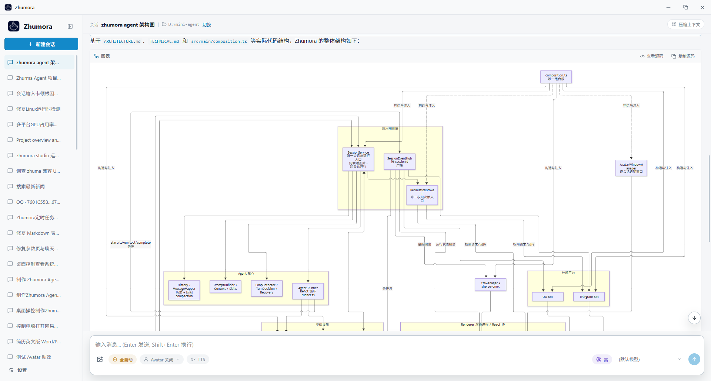

# Zhumora Agent

An open source desktop AI agent for Windows and Ubuntu Linux.

Zhumora connects to OpenAI-compatible models and can work with your files, terminal, browser, and desktop. It is designed as a local-first agent runtime with support for MCP, skills, memory, and user-controlled permissions.

[简体中文](README.md) · [Technical documentation](./TECHNICAL.md) · [Bilibili video](https://www.bilibili.com/video/BV1Yyew6SEmN/)

<p align="center">
  
</p>

<p align="center">
  
</p>

## Features

- Connect to OpenAI-compatible APIs, including local endpoints such as Ollama, llama.cpp, and vLLM
- Read, edit, search, and manage files in the selected workspace
- Read and write Word, Excel, PowerPoint, and PDF artifacts with format-specific built-in tools
- Run terminal commands
- Automate Chromium with Playwright
- Observe and control Windows applications with accessibility targets, screenshots, mouse, and keyboard input (on Linux, desktop control keeps screenshot observation only)
- Extend tools through MCP servers
- Serve as an MCP server that external orchestrators (Claude Code, Codex, …) can delegate tasks to
- Load reusable skills from Markdown files
- Local session history, long-term memory, and token usage records
- Chat with the same agent from your phone through a Telegram bot or a QQ bot, with live progress updates
- Import VRM characters and opt into a separate transparent Avatar window per session, with Agent-controlled configured motions and expressions
- Import local sherpa-onnx VITS/Kokoro voices and opt into spoken final responses per session
- Permission prompts for potentially dangerous actions
- Light / dark themes and multilingual UI

## Chat from Telegram and QQ

Open **Settings → Chat Bots** and connect a Telegram bot or a QQ bot, then talk to the same local agent from your phone — no need to sit at the desktop.

<p align="center">
  
</p>

- **Two platforms** — Telegram via BotFather token, QQ via the AppID / AppSecret from QQ Open Platform. Both run the same agent, tools, permissions, and session history
- **See it working** — thinking streams live (`💭 …`) and every tool call shows up as it happens (`🔧 bash: npm test`), turning into `✅ 1.2s` when it finishes, so a long task never looks frozen
- **Approve from anywhere** — risky actions ask for confirmation in the chat: inline Allow / Deny buttons on Telegram, a `y` / `n` reply on QQ
- **Stay in control** — the bots only answer users you whitelist (send `/id` to get your ID / OpenID), and `/stop` cancels the current run at any moment

## Desktop control

Zhumora can operate the Windows desktop directly:

- **Observe** — list running applications, capture screens, and read the UI accessibility tree of any window (with short-lived semantic element targets)
- **Act** — click, double-click, right-click, type, press keys, scroll, drag, focus, and toggle controls, targeting elements by accessibility reference or screenshot coordinates
- **Verify** — attach a screenshot after state-changing actions so the agent can confirm the result; plain pointer moves skip capture unless requested

This lets Zhumora drive native Windows apps that have no API or CLI — not just files, shell, and the browser.

> On Linux the accessibility tree and input injection rely on the Windows-only Terminator library, so desktop control is limited to **screenshot observation** (`desktop_observe` in `screen` mode); all other capabilities (files, shell, browser, …) are unaffected.

## As an MCP server for external orchestrators

Zhumora is also an MCP server. External orchestrators such as Claude Code and Codex can treat it as a collaborator, hand it a bounded task, and let the same local agent do the work.

Turn it on under **Settings → MCP Inbound**. The page shows the live status and endpoint, and generates client configs you can paste directly (JSON for Claude Desktop, Cursor, Cline, …; TOML for Codex).

- **Loopback plus a token** — the server only listens on `127.0.0.1`, and clients authenticate with `Authorization: Bearer <token>`. The token is generated on first enable and persisted as-is, never rotated on app restart; re-copy the config after changing the token or port.
- **A delegation is a session** — every delegated task becomes a Zhumora session in the sidebar, reporting progress and writing history exactly like a session you started at the desktop, and it can be aborted at any time.
- **Follow through to the end** — the orchestrator posts work with `zhumora_chat` and waits with `zhumora_wait` (bounded long wait plus progress notifications), so it receives a self-contained final answer instead of mistaking `running` for done; results survive a dropped connection.
- **Permissions stay yours** — with the default “UI only” mode the orchestrator only sees that a task is awaiting permission, and you approve or deny in Zhumora. With “delegate” enabled it may approve normal-level tools through `zhumora_respond` within the authority you give it; dangerous actions always wait for you.
- **Diagnostics, not polling** — `zhumora_status` returns a transient snapshot of a task and is not a polling channel.

## Quick start

### Requirements

- Windows 10 / 11, or Ubuntu Linux (x64)
- Node.js 22.12+ (Node.js 24 LTS recommended)
- npm

### Install

```bash
npm install
```

### Development

```bash
npm run dev
```

### Build

```bash
npm run build
```

### Package for Windows

```bash
npm run build:win
```

### Package for Linux (AppImage / deb)

```bash
npm run build:linux
```

The installer is written to `release/`.

## Model configuration

Open **Settings** and add an OpenAI-compatible provider:

- Base URL
- API key, if required
- Model name
- Temperature
- Reasoning effort
- Context window

Local and remote endpoints are both supported.

## VRM Avatar

Import `.vrm` characters under **Settings → Avatar**, then configure embedded animation names or attach `.vrma` animations. Avatars are off by default for every session; select one from the upward-opening Avatar menu in the composer when needed. The character runs in its own draggable transparent window, and the Agent can only invoke motions and expressions reported or configured for that model.

Avatars include application-owned idle, thinking, explaining, nodding, head-shaking, greeting, waving, shrugging, bowing, applause, celebration and sadness motions, adapted to VRM 0/1. Default motions use restrained upper-body movement with naturally hanging arms; a procedural life layer adds breathing, subtle weight shifts, arm sway and finger flexion to every clip. Greeting, waving and celebration add a smile, while sadness lowers the head and uses the model's sad expression when available. They blink and vary their idle pose without LLM calls. Agent activity drives thinking and response gestures; one-shot gestures return to the current activity with blended transitions. Mouse gaze follows only inside the Avatar window and smoothly returns forward on exit. Expressions fade in and return to neutral automatically. Explicitly configured custom animations retain their own choreography.

Drag the character, message bubble or top handle to move its window; empty transparent space remains click-through. **Settings → Avatar → Window size** controls width and height in logical pixels for all Avatar windows, including already open ones after saving. Windows are fitted to the monitor's available work area.

## Local TTS

Import a compatible sherpa-onnx VITS or Kokoro model folder under **Settings → Speech**, then select the default voice and its speaker ID/speed. The TTS button in the composer is off for every new session. When enabled, only the final assistant response is converted from Markdown to bounded prose, synthesized locally, and played; Agent prompts, tools, and history are unchanged. Starting another request or synthesis interrupts the previous speech. Imported weights keep their own license and must contain `tokens.txt` plus one ONNX model file (`model.onnx` is preferred); Kokoro also requires `voices.bin`.

In the animation library, use the semantic dropdown to replace a built-in motion with an imported clip; the star selects the startup idle. The Agent can use one `avatar_control` call with `action: "perform"`, an `intent` and optional `emotion`/`intensity`. Exact clip playback remains available for explicit looping. Imported motion quality and unusual character proportions can still require model-specific animation adjustments.

No character model is bundled. The `@pixiv/three-vrm` code is MIT-licensed, but each VRM model has its own license; verify the model author's terms before importing or redistributing it.

## Documentation

The authoritative session/message architecture and contribution rules are documented in [ARCHITECTURE.md](./ARCHITECTURE.md) and [AGENTS.md](./AGENTS.md). Tool interfaces, context management, memory, MCP, and build notes are in [TECHNICAL.md](./TECHNICAL.md).

## License

Zhumora is licensed under the [AGPL-v3.0](./LICENSE.md).

Versions previously made available under the MIT License remain available under
the terms granted for those versions. Third-party components retain their own
licenses; see [THIRD_PARTY_NOTICES.md](./THIRD_PARTY_NOTICES.md).
