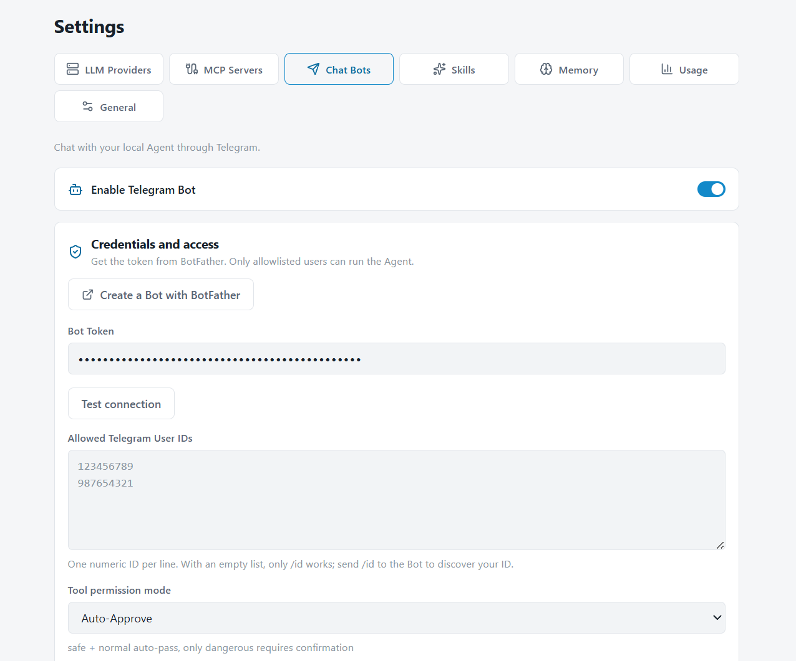

# Zhumora Agent

An open-source desktop AI agent for Windows.

Zhumora connects to OpenAI-compatible models and can work with your files, terminal, browser, and desktop. It is designed as a local-first agent runtime with support for MCP, skills, memory, and user-controlled permissions.

[简体中文](./README.zh-CN.md) · [Technical documentation](./TECHNICAL.md)

<p align="center">
  
</p>

## Features

- Connect to OpenAI-compatible APIs, including local endpoints such as Ollama, llama.cpp, and vLLM
- Read, edit, search, and manage files in the selected workspace
- Read and write Word, Excel, PowerPoint, and PDF artifacts with format-specific built-in tools
- Run terminal commands
- Automate Chromium with Playwright
- Observe and control Windows applications with accessibility targets, screenshots, mouse, and keyboard input
- Extend tools through MCP servers
- Load reusable skills from Markdown files
- Local session history, long-term memory, and token usage records
- Chat with the same agent from your phone through a Telegram bot or a QQ bot, with live progress updates
- Import VRM characters and opt into a separate transparent Avatar window per session, with Agent-controlled configured motions and expressions
- Permission prompts for potentially dangerous actions
- Light / dark themes and multilingual UI

## Chat from Telegram and QQ

Open **Settings → Chat Bots** and connect a Telegram bot or a QQ bot, then talk to the same local agent from your phone — no need to sit at the desktop.

<p align="center">
  
</p>

- **Two platforms** — Telegram via BotFather token, QQ via the AppID / AppSecret from QQ Open Platform. Both run the same agent, tools, permissions, and session history
- **See it working** — thinking streams live (`💭 …`) and every tool call shows up as it happens (`🔧 bash: npm test`), turning into `✅ 1.2s` when it finishes, so a long task never looks frozen
- **Approve from anywhere** — risky actions ask for confirmation in the chat: inline Allow / Deny buttons on Telegram, a `y` / `n` reply on QQ
- **Stay in control** — the bots only answer users you whitelist (send `/id` to get your ID / OpenID), and `/stop` cancels the current run at any moment

## Desktop control

Zhumora can operate the Windows desktop directly:

- **Observe** — list running applications, capture screens, and read the UI accessibility tree of any window (with stable element targets)
- **Act** — click, double-click, right-click, type, press keys, scroll, drag, focus, and toggle controls, targeting elements by accessibility reference or screenshot coordinates
- **Verify** — attach a screenshot after each action so the agent can confirm the result before continuing

This lets Zhumora drive native Windows apps that have no API or CLI — not just files, shell, and the browser.

## Quick start

### Requirements

- Windows 10 / 11
- Node.js 22.12+ (Node.js 24 LTS recommended)
- npm

### Install

```bash
npm install
```

### Development

```bash
npm run dev
```

### Build

```bash
npm run build
```

### Package for Windows

```bash
npm run build:win
```

The Windows installer is written to `release/`.

## Model configuration

Open **Settings** and add an OpenAI-compatible provider:

- Base URL
- API key, if required
- Model name
- Temperature
- Reasoning effort
- Context window

Local and remote endpoints are both supported.

## VRM Avatar

Import `.vrm` characters under **Settings → Avatar**, then configure embedded animation names or attach `.vrma` animations. Avatars are off by default for every session; select one from the upward-opening Avatar menu in the composer when needed. The character runs in its own draggable transparent window, and the Agent can only invoke motions and expressions reported or configured for that model.

Avatars include application-owned idle, thinking, explaining, nodding, head-shaking, greeting, celebration and sadness motions, adapted to VRM 0/1. Default motions use restrained head/body movement with relaxed arms; greeting and celebration add a smile, while sadness lowers the head and uses the model's sad expression when available. They blink and vary their idle pose without LLM calls. Agent activity drives thinking and response gestures; one-shot gestures return to the current activity with blended transitions. Mouse gaze follows only inside the Avatar window and smoothly returns forward on exit. Expressions fade in and return to neutral automatically. Explicitly configured custom animations retain their own choreography.

Drag the character, message bubble or top handle to move its window; empty transparent space remains click-through. **Settings → Avatar → Window size** controls width and height in logical pixels for all Avatar windows, including already open ones after saving. Windows are fitted to the monitor's available work area.

In the animation library, use the semantic dropdown to replace a built-in motion with an imported clip; the star selects the startup idle. The Agent can use one `avatar_control` call with `action: "perform"`, an `intent` and optional `emotion`/`intensity`. Exact clip playback remains available for explicit looping. Imported motion quality and unusual character proportions can still require model-specific animation adjustments.

No character model is bundled. The `@pixiv/three-vrm` code is MIT-licensed, but each VRM model has its own license; verify the model author's terms before importing or redistributing it.

## Documentation

Implementation details, architecture, tool interfaces, context management, memory, MCP, and build notes are documented in [TECHNICAL.md](./TECHNICAL.md).

## License

[MIT](https://opensource.org/licenses/MIT)
