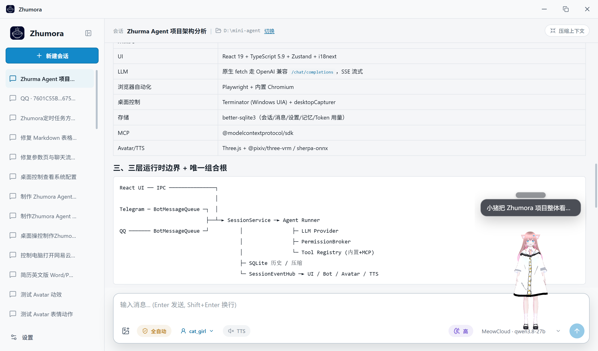

# Zhumora

开源 Windows 桌面 AI 智能体。

Zhumora 可以连接 OpenAI 兼容模型，并操作你的文件、终端、浏览器和桌面。程序本体以本地运行为主，同时支持 MCP、Skills、长期记忆和权限控制。

[English](./README.md) · [技术文档](./TECHNICAL.md)

<p align="center">
  
</p>

## 功能

- 支持 OpenAI 兼容 API，也可接入 Ollama、llama.cpp、vLLM 等本地端点
- 在指定工作目录内读取、编辑、搜索和管理文件
- 通过按格式划分的内置工具读写 Word、Excel、PowerPoint 和 PDF 文件
- 执行终端命令
- 使用 Playwright 自动化 Chromium
- 通过无障碍元素、截图、鼠标和键盘观察并控制 Windows 应用
- 通过 MCP 扩展工具
- 从 Markdown 文件加载 Skills
- 本地保存会话、长期记忆和 Token 用量
- 接入 Telegram Bot，用手机和同一个本地 Agent 对话，实时显示进度
- 对高风险操作进行权限确认
- 支持深色 / 浅色主题与多语言界面

## 用 Telegram 随身对话

在 **设置** 里接入 Telegram Bot，就能用手机和同一个本地 Agent 对话，不必守在电脑前。

- **看得见进度** — 思考过程实时流出（`💭 …`），每个工具调用都即时可见（`🔧 bash: npm test`），完成后变成 `✅ 1.2s`，长时间任务不会让人以为卡死
- **随时随地审批** — 高风险操作会把「允许 / 拒绝」按钮直接发到聊天里
- **始终可控** — Bot 只响应白名单用户（先发 `/id` 拿到自己的 ID），随时 `/stop` 中止当前任务

## 桌面控制

Zhumora 可以直接操作 Windows 桌面：

- **观察** — 列出运行中的应用、截取屏幕、读取任意窗口的 UI 无障碍树（含稳定的元素目标引用）
- **操作** — 点击、双击、右键、输入、按键、滚动、拖拽、聚焦、切换控件，可基于无障碍元素引用或截图坐标定位
- **验证** — 每次操作后可附带截图，让智能体确认结果后再继续

这让 Zhumora 能够驱动没有 API 或命令行的原生 Windows 应用，而不仅仅是文件、终端和浏览器。

## 快速开始

### 环境要求

- Windows 10 / 11
- Node.js 22.12+（推荐 Node.js 24 LTS）
- npm

### 安装

```bash
npm install
```

### 开发

```bash
npm run dev
```

### 构建

```bash
npm run build
```

### 打包 Windows 安装包

```bash
npm run build:win
```

安装包输出到 `release/`。

## 模型配置

在 **设置** 中添加 OpenAI 兼容 Provider：

- Base URL
- API Key（如需要）
- 模型名称
- Temperature
- Reasoning Effort
- Context Window

本地和远程模型端点均可使用。

## 文档

架构、工具系统、上下文管理、长期记忆、MCP 和构建细节见 [TECHNICAL.md](./TECHNICAL.md)。

## License

[MIT](https://opensource.org/licenses/MIT)
